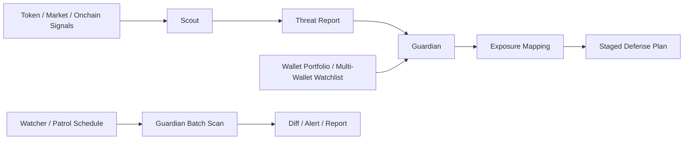

# OKX RugShield 🛡️

[](./package.json)
[](./SKILL.md)
[](#)
[](./docs/AI_SETUP.md)
[](./docs/GUARDIAN_PIPELINE.md)

OKX RugShield is an OpenClaw + OKX OnchainOS project focused on **onchain meme / rug defense**.

It is designed as a three-layer system:

- **Scout**: discovers token-level threats
- **Guardian**: maps those threats to wallet exposure and defense plans
- **Watcher**: monitors multiple wallets on a schedule and alerts on new / worsening risk

## Why this project exists

Most onchain AI tools help users find the next opportunity.
RugShield focuses on the opposite problem:

- hidden exposure to risky meme coins
- sudden dev dumping or smart-money exits
- deteriorating liquidity
- dust / scam token clutter across multiple wallets
- not knowing what to reduce first when risk shows up

## Architecture at a glance



## Layer responsibilities

### 1. Scout Agent
`rugshield-scout` is responsible for:

- scanning token risk signals
- identifying patterns such as dev dumping, smart-money exits, liquidity deterioration, and abnormal trading behavior
- producing structured `Threat Report` output
- generating simulated threat events for demos
- supporting proactive patrol / alert entry points in the prototype stage

### 2. Guardian Agent
`rugshield-guardian` is responsible for:

- checking whether a wallet holds risky or related assets
- aggregating exposure across multiple wallets
- generating staged defensive exit plans
- simulating routes before any execution-oriented step
- deciding whether confirmation is required based on the active mode
- bridging from `Threat Report` to wallet-aware defense planning
- producing readable defense reports from real wallet portfolio data

### 3. Watcher / Patrol Layer
Watcher is the monitoring layer for scheduled use:

- scans multiple wallets repeatedly
- calls Guardian in batch
- compares current scan results to previous state
- surfaces only new or worsening risk
- provides the proactive monitoring entry point for OpenClaw automation
- now has a dedicated `rugshield-watch` skill entry for natural-language patrol intent

## Demo vs Live

### Demo Mode
Use when:
- official OKX dependencies are not fully installed
- credentials are unavailable
- you want a fast walkthrough for judges or reviewers

Supports:
- mock risk scans
- mock patrol
- guardian simulation
- benchmark scenarios

### Live Mode
Use when:
- official OKX / OnchainOS skills are installed
- credentials are configured
- environment is ready

Supports:
- live token signal prototype path
- live wallet portfolio prototype path
- multi-wallet watcher MVP

## OpenClaw-first usage

If you are an OpenClaw user, the primary path is **not** manually running npm commands.
The main path is:

1. install official OKX / OnchainOS skills
2. install RugShield skills
3. talk to OpenClaw directly
4. optionally enable watcher-based scheduled monitoring

See:
- [SKILL.md](./SKILL.md)
- [docs/OPENCLAW_USAGE.md](./docs/OPENCLAW_USAGE.md)
- [docs/ARCHITECTURE.md](./docs/ARCHITECTURE.md)
- [docs/GUARDIAN_PIPELINE.md](./docs/GUARDIAN_PIPELINE.md)
- [docs/INTENT_ROUTING.md](./docs/INTENT_ROUTING.md)

## Local developer / judge commands

```bash
npm install
cp .env.example .env
npm run preflight
npm run demo
npm run replay:mock
npm run patrol:mock
npm run simulate:guardian
npm run benchmark:verbose
```

### Live prototypes

```bash
npm run live:signal -- OKB xlayer
npm run live:portfolio -- 0x58e79a0c44e9bf71152bd2e51fea4c88b8a05097 xlayer,ethereum,base,arbitrum,bsc 8
npm run watch:wallets -- --config ./config/watch-wallets.example.json
```

## What the current prototype already does

- Scout + Guardian skill split
- Threat Report generation
- mock replay / mock patrol flows
- live portfolio-readable report output
- garbage-position filtering and risk grouping
- staged defense recommendations
- multi-wallet watcher MVP entrypoint

## What is still prototype-stage

- production-grade automated execution
- full real-money autonomous defense loop
- advanced watcher alert delivery integrations
- route simulation hardening across all chains
- richer historical diff analytics

## Positioning

A concise positioning statement for the repo:

> **OKX RugShield is a multi-wallet onchain meme / rug defense system: Scout discovers threats, Guardian maps exposure and plans defense, and Watcher performs scheduled patrol plus alerting.**
