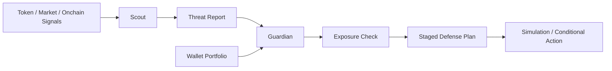

# OKX RugShield 🛡️

[English](./README.md) | [简体中文](./README.champion-style.md)

[](./package.json)
[](./SKILL.md)
[](./docs/AI_SETUP.md)
[](./docs/GUARDIAN_PIPELINE.md)
[](./scripts/preflight.sh)

Built on OKX Skills, packaged as an onchain **defense workflow**.

Creator on X: [@your_handle_here](https://x.com/)

Quick links:

- [Chinese README](./README.champion-style.md)
- [Skill Layer](./SKILL.md)
- [Architecture](./docs/ARCHITECTURE.md)
- [Guardian Pipeline](./docs/GUARDIAN_PIPELINE.md)
- [Live Proof](./docs/LIVE_PROOF.md)
- [Evidence Ledger](./docs/EVIDENCE_LEDGER.md)
- [Runbook](./docs/RUNBOOK.md)
- [Benchmark Scenarios](./scenarios/demo-scenarios.v1.json)

OKX RugShield is a local-first OpenClaw + OKX OnchainOS project that turns low-level token, market, and portfolio capabilities into a higher-level **rug-risk defense workflow**.

OKX provides the primitive skills.
RugShield packages them into a reusable safety pipeline that other agents or users can call to:
- detect rug-related risk signals
- verify wallet exposure
- generate staged exit plans
- produce auditable defense reports



The product structure is explicit:

- **signal layer**: identify suspicious token behavior and convert it into a structured Threat Report
- **defense layer**: map that threat to real wallet exposure and prioritize what needs attention first
- **response layer**: turn the situation into a staged, auditable defensive plan instead of vague warnings

RugShield is not trying to replace stronger reasoning models, market analysis tools, or the official OKX primitive skills.
It is the **defense and control layer** they can call when they want to translate danger signals into wallet-aware action plans.

---

## Why It Is Reusable

RugShield is reusable in two ways:

### 1. User mode
A user asks:
- “这个币有没有 rug 风险？”
- “我钱包里有没有暴露？”
- “先减哪个仓位？”

RugShield converts those questions into a repeatable defense workflow.

### 2. Agent mode
Another AI or workflow can reuse the same pipeline:
- scout risk
- generate Threat Report
- call guardian
- return a machine-readable defense plan

That is the real replication story:

- OKX Skills stay at the primitive layer
- RugShield stays at the workflow layer
- downstream agents reuse the defense workflow without rebuilding the full risk pipeline each time

---

## For Demo vs. For Live Usage

### Demo Mode
Demo mode is designed for judges, reviewers, and users who do not yet have the full OKX dependency stack.

It supports:
- mock risk scans
- mock event replay
- guardian simulation
- manual analysis mode

This keeps the project evaluable even when official upstream skills or credentials are not yet installed.

### Live Mode
Live mode enables:
- live token / market signal checks
- live wallet portfolio checks
- stronger guardian response flows

Live mode depends on:
- official OKX / OnchainOS skills
- OKX credentials
- a correct local runtime environment

So the dependency policy is deliberate:

> detect first, warn clearly, degrade gracefully, and only claim live capability when the environment truly supports it.

---

## What It Does

- **detect rug risk**: identify liquidity drops, abnormal volume, dev sell pressure, smart-money exits, and similar signals
- **generate Threat Report**: convert raw findings into a structured object with risk level, confidence, and next action
- **check wallet exposure**: inspect whether risky tokens or related assets exist in the target wallet portfolio
- **build staged exit plans**: prioritize direct exposure first and return a sequence of defensive actions
- **simulate response**: provide an auditable simulated plan when real execution should not happen
- **support OpenClaw skills**: split the workflow into `rugshield-scout` and `rugshield-guardian`

---

## Quick Start

```bash
npm install
cp .env.example .env
npm run preflight
npm run demo
npm run replay:mock
npm run patrol:mock
npm run simulate:guardian
npm run benchmark:verbose
```

Optional live prototype examples:

```bash
npm run live:signal -- OKB xlayer
npm run live:portfolio -- 0x58e79a0c44e9bf71152bd2e51fea4c88b8a05097 xlayer,ethereum,base,arbitrum,bsc 1
```

Before a public demo or judging run, execute:

```bash
npm run preflight
```

This checks:
- runtime readiness
- project structure
- local skill installation
- official OKX dependency visibility
- environment variables
- demo vs live readiness

---

## Local OpenClaw Skill Installation

RugShield ships as two local-first skills:

- `rugshield-scout`
- `rugshield-guardian`

Install locally:

```bash
bash skills/rugshield-scout/scripts/install-local.sh
bash skills/rugshield-guardian/scripts/install-local.sh
```

Default install path:

```bash
~/.openclaw/workspace/skills/
```

If needed:

```bash
export RUGSHIELD_PROJECT_DIR=/path/to/OKX-RugShield
```

---

## Reproducibility

RugShield includes or recommends:

- `scripts/preflight.sh`
- `scripts/benchmark-runner.js`
- `scenarios/demo-scenarios.v1.json`
- mock replay flows
- live prototype entry points

Suggested judging commands:

```bash
npm install
npm run preflight
npm run demo
npm run replay:mock
npm run simulate:guardian
npm run benchmark:verbose
```

If official OKX dependencies are already configured:

```bash
npm run live:signal -- OKB xlayer
npm run live:portfolio -- 0x58e79a0c44e9bf71152bd2e51fea4c88b8a05097 xlayer,ethereum,base,arbitrum,bsc 1
```

---

## Output Boundaries

### Already implemented
- dual-skill structure: Scout + Guardian
- Threat Report generation
- mock / replay / patrol flows
- live signal prototype
- live portfolio prototype
- staged defense strategy prototype
- preflight and benchmark framework

### Not fully implemented yet
- production-grade automatic execution
- full real-money autonomous defense loop
- mempool / pending transaction preemptive defense
- full autonomous patrol scheduler

So the project should be evaluated accurately as:

> a demonstrable, testable, extensible onchain defense prototype

---

## Why It Matters

Most onchain AI products help users find the next opportunity.
RugShield focuses on what users fear more:

- hidden exposure
- rapidly worsening token risk
- not knowing what to reduce first
- acting too late

RugShield pushes onchain AI one step closer to a safety-native workflow:

> detect risk early, map it to real holdings, and return a usable defense response before the loss expands.

---

## Roadmap

- add stricter executable benchmark validation
- strengthen machine-readable report schemas
- improve official OKX dependency detection
- add screenshots, GIFs, and X demo links
- improve live-mode operational guidance
- extend the defense loop under explicit safety and authorization controls
